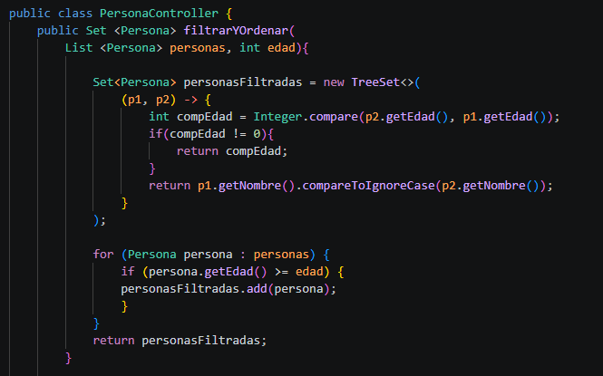
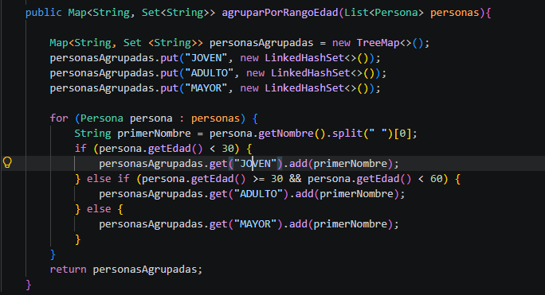

# Práctica: [Práctica con Mapas y Sets]

## Datos del Estudiante
- **Nombre:** [Nataly Jiménez Salazar]
- **Curso:** [Grupo - 3 - Computación]
- **Fecha:** [2026-06-30]

---

## 1. [Metódo A: filtrarYOrdenar]

**Fecha:** 2026 - 06 - 30

**Preguntas:** 

- ¿Qué implementación de Set o Map se utilizó? 
La implementación que se uso en este método fue un ``TreeSet``.
- ¿Por qué se eligió esa implementación?
Se eligió este método debido a que en la consigna se pide que la lista de personas recibida debe tener un orden de edad descendente, y el ``Set: TreeSet``nos permite aplicar orden en los elementos según el criterio de comparación cada que se ingresa uno nuevo.

- ¿Cómo se garantiza la unicidad de los datos?
La unicidad de los datos se garantiza através del comparador que recibe el ``TreeSet``, que compara primero por edad y luego por nombre, en caso de que dos personas tengan la misma edad y mismo nombre (ignorando mayúsculas o minúsculas), devuelve 0. Entonces, el ``TreeSet`` agarra ese resultado para determinar si elemento ya existe, y así no ingresar el segundo.

- ¿Cómo se conserva o define el orden de los resultados?
El orden se conserva con el comparador en el ``TreeSet``, se inicia comparando descendentemente la edad con un orden donde primero va ``p2(Persona 2)`` con la ``p1(Persona 1)``, si tienen la misma edad comparan ascendentemente e ignorando mayúsculas con ``compareToIgnoreCase``y el ``TreeSet``, como se mencionó anteriormente, se encarga del orden.

- ¿Cómo funciona la lógica aplicada en cada método?
Primero iniciamos con la lista recibida y se crea un ``TreeSet`` de ``personasFiltradas`` indicándole al comparador que ordene por edad descendente y en caso de que las edades sean iguales, se ordena por nombre ascendente ignorando mayúsculas. Luego recorremos con un foreach de persona, y si su edad es mayor o igual, la agregamos al ``TreeSet``. Al agregarla, el propio ``TreeSet`` la ubica en su posición según el comparador, pero si ya existe esa persona con el mismo nombre y edad, no la vuelve a agregar. Al final se devuelve ``personasFiltradas`` ya filtrada, ordenada y sin duplicados.

***Bloque de Código***

---

## 2. [Método B: agruparPorRangoEdad]

**Fecha:** 2026 - 06 - 30

**Preguntas:**

- ¿Qué implementación de Set o Map se utilizó?
La implementación que se uso fue un ``Map``, especificamente ``TreeMap`` en conjunto de un ``Set: LinkedHashSet``.

- ¿Por qué se eligió esa implementación?
En esta implementación se eligió el ``Map: TreeMap`` porque ordena sus claves alfabéticamente y de forma automática y, se eligió el ``Set: LinkedHashSet`` porque no permite elementos duplicados y establece el orden según se vaya ingresando los datos, así respetando el orden de los nombres en la lista original.

- ¿Cómo se garantiza la unicidad de los datos?
La unicidad se garantiza de los datos gracias al ``Set``, que no permite elementos duplicados, al usar ``LinkedHashSet<String>`` como valor de cada clave del mapa, si se agrega dos veces el mismo ``primerNombre`` con ``add()``, el segundo nombre no se añadiría, evitando nombres repetidos dentro de la misma lista que luego se devuelve.

- ¿Cómo se conserva o define el orden de los resultados?
Se conserva el orden de los resultados gracias a la responsabilidad que tiene el ``TreeMap``, ordenando la clave alfabéticamente de tipo ``String(Joven, Adulto, Mayor)`` y, el ``LinkedHashSet`` que conserva el orden de inserción de la lista añadida en el App.

- ¿Cómo funciona la lógica aplicada en cada método?
Primero se crea un ``TreeMap`` con las claves ``String`` "JOVEN", "ADULTO", "MAYOR" con un ``Set<String>`` - ``LinkedHashSet``, se recorre la lista agregada con un ``foreach`` que solo obtiene el primer nommbre con el ``.split()``. Se evalua con un ``if`` las edades, si es menor a 30 entra en "JOVEN", ``if else``si es menor o igual a 30 y menor a 60 entra en "ADULTO", ``else`` si es mayor de 60 entra en "MAYOR", según el resultado se devuelve el mapa ya ordenado.

***Bloque de Código:***

---

